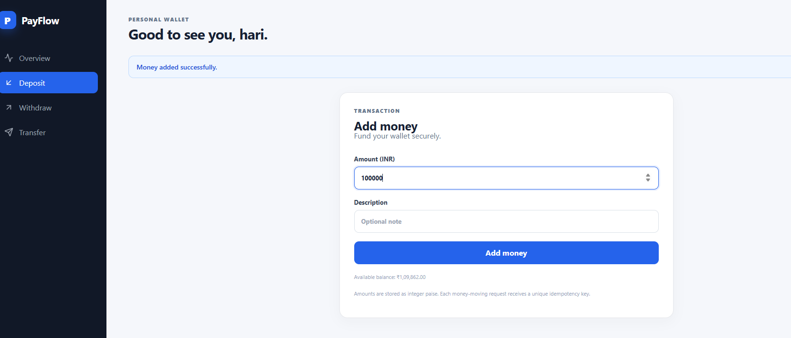
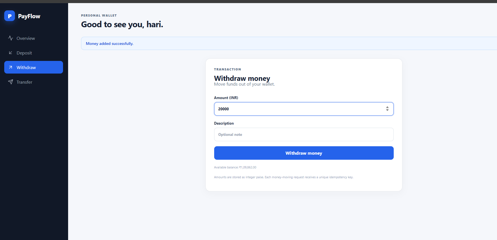
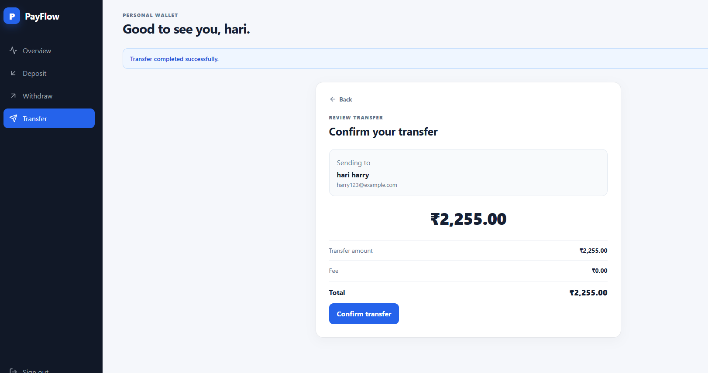
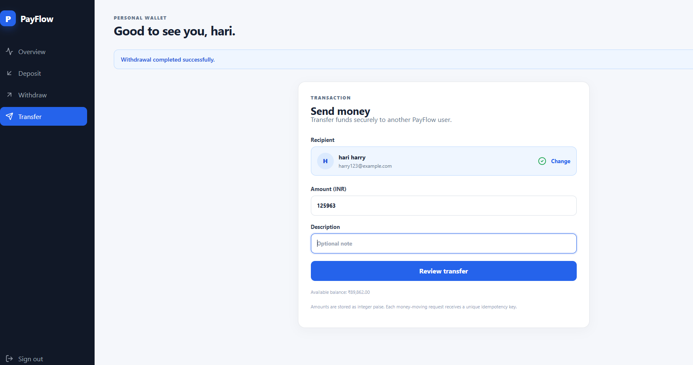
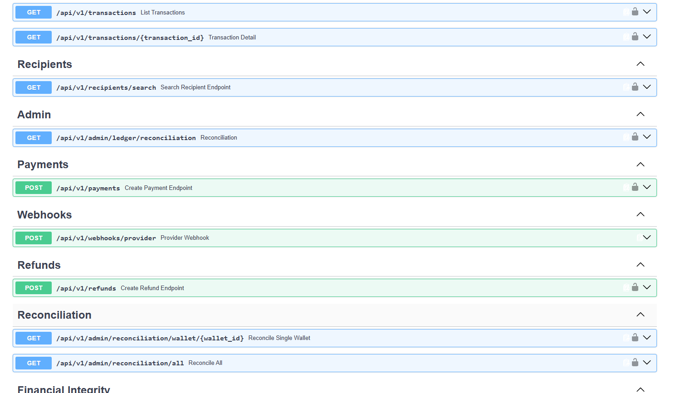
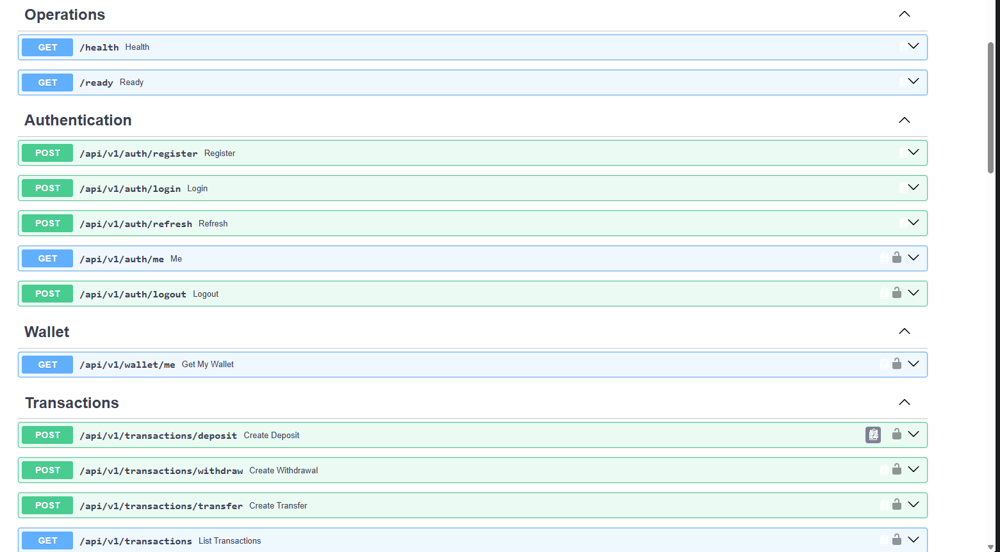

# PayFlow — Wallet & Payment Platform

PayFlow is a full-stack wallet and payment platform I built to get hands-on
experience with the kind of backend problems that show up in real financial
systems.

I didn't want this to be just another CRUD project where a user clicks a
button and a balance changes.

I wanted to understand what happens when the same request is sent twice, when
two transactions happen at the same time, when a payment provider retries a
webhook, or when background processing fails.

That became the main idea behind the project.

---

## What I Built

PayFlow currently supports:

- User authentication
- Wallet creation
- Deposits
- Withdrawals
- Wallet-to-wallet transfers
- Payments
- Refunds
- Payment webhooks
- Refund webhooks
- Transaction history
- Idempotent requests
- Rate limiting
- Background event processing
- Retry handling
- Reconciliation
- Admin operations

The backend is built with Python and FastAPI, PostgreSQL is used for the
database and ledger, Redis is used for rate limiting, and the complete system
can be run with Docker Compose.

---

# Tech Stack

### Backend

- Python
- FastAPI
- SQLAlchemy
- PostgreSQL
- Alembic
- Pydantic
- JWT authentication

### Infrastructure

- Redis
- Docker
- Docker Compose

### Frontend

- React
- Vite
- Axios
- Lucide React

### Testing

- Pytest
- Pytest Asyncio

---

# Architecture

                     PAYFLOW
                       │
                 React Frontend
                       │
                       ▼
                 FastAPI Backend
                       │
          ┌────────────┼────────────┐
          ▼            ▼            ▼
      PostgreSQL      Redis       JWT Auth
          │
          ▼
    Double-Entry Ledger
          │
          ▼
      Outbox Events
          │
          ▼
    Background Worker
          │
          ▼
 Payment / Refund Processing
          

## Application Screenshots

### Sign Up

### Add Money

### Withdraw

### Transfer

### Send Money

### API Documentation

